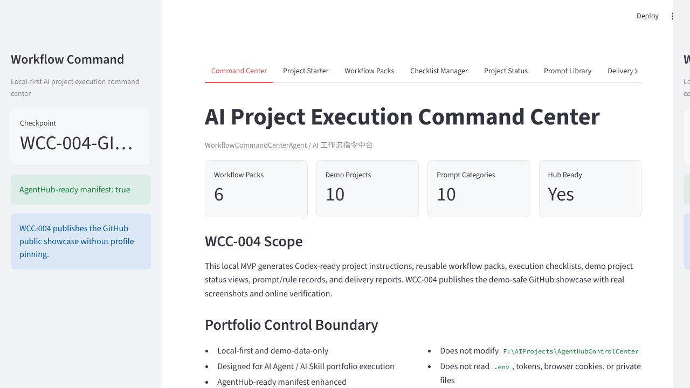
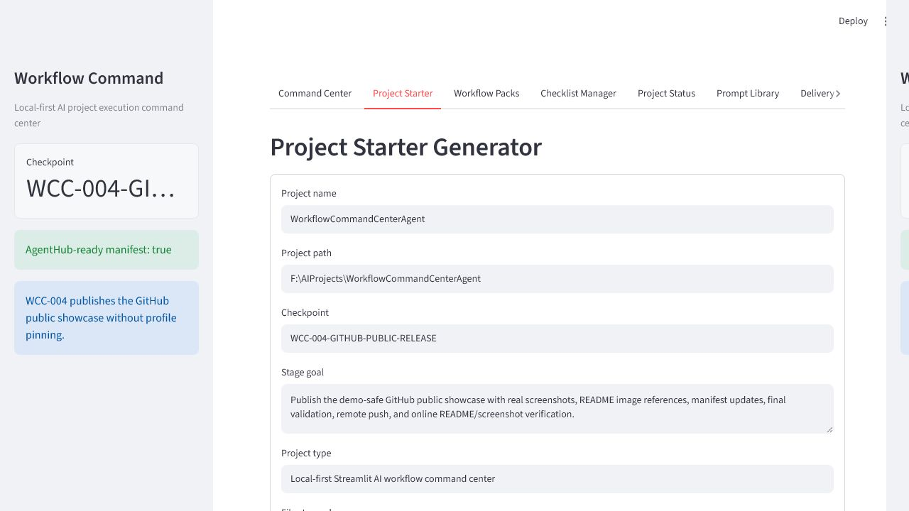
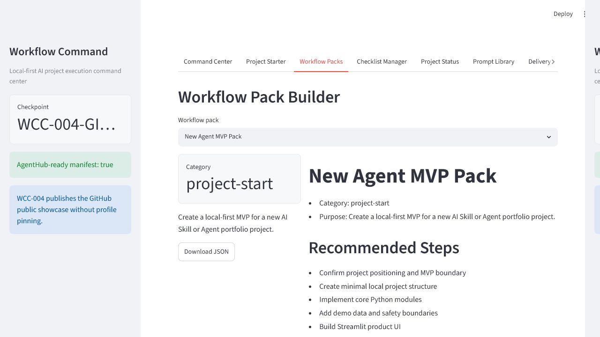
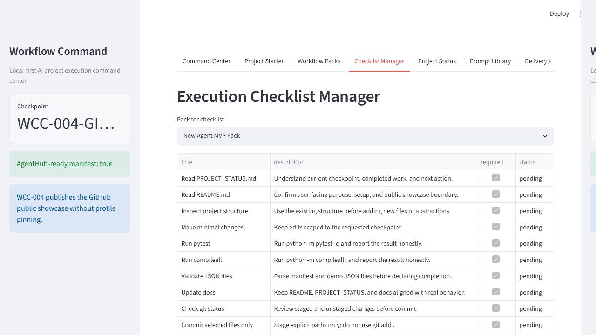
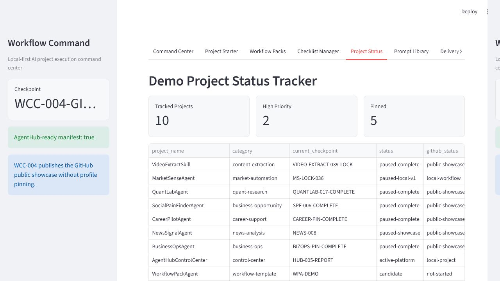
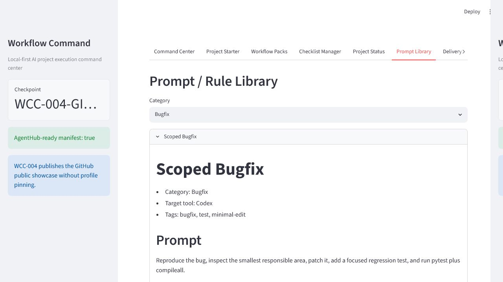
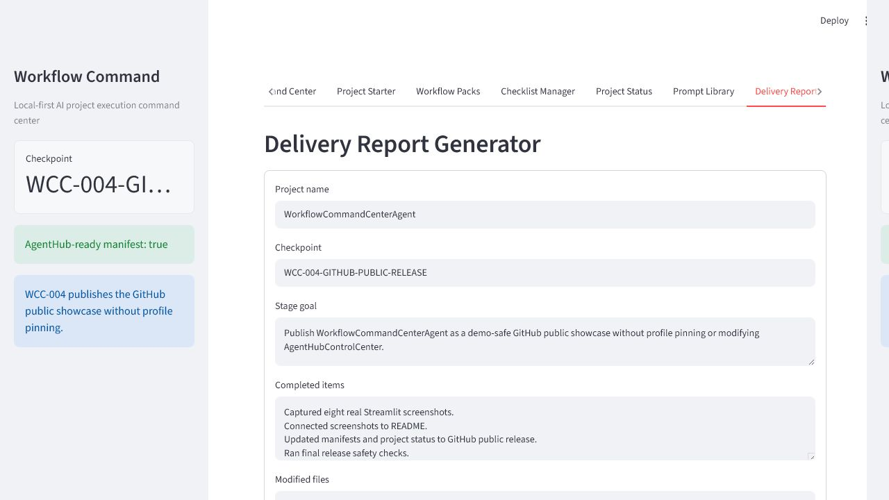
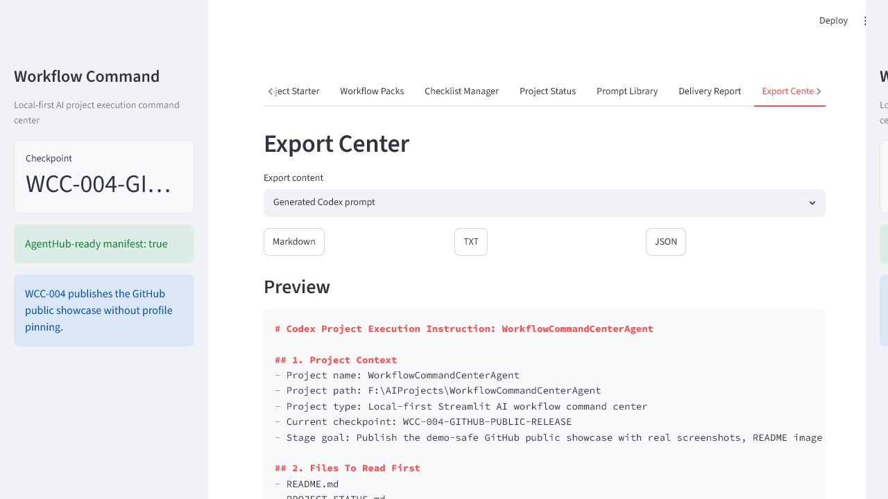

# WorkflowCommandCenterAgent

AI 工作流指令中台 / 项目启动与执行控制台。

WorkflowCommandCenterAgent is a local-first AI workflow command center for generating Codex-ready project instructions, reusable workflow packs, execution checklists, demo portfolio status views, prompt/rule records, delivery reports, and exportable Markdown / TXT / JSON artifacts.

## Project Overview

This project is the "project execution command center" in an AI Agent portfolio matrix.

It helps an AI product creator, automation consultant, or Agent builder repeatedly answer:

- What should Codex do next?
- Which files should be read first?
- What actions are allowed or blocked?
- Which validation commands should run?
- What checklist should guide the execution?
- What delivery report should summarize the checkpoint?
- What public showcase boundaries must be respected?

## Why This Is Not A Simple Prompt Library

WorkflowCommandCenterAgent is built around checkpoint-based delivery, not isolated prompt snippets.

It connects project starter instructions, reusable workflow packs, execution checklist generation, demo portfolio status tracking, prompt and rule records, delivery report generation, public showcase checks, and Markdown / TXT / JSON exports.

A normal prompt library stores text. This project turns repeated AI project execution into a structured local workflow.

## Core Capabilities

- Project Starter Generator for Codex-ready execution instructions
- Workflow Pack Builder with six demo workflow packs
- Execution Checklist Manager generated from workflow packs
- Demo Project Status Tracker for the AI Agent portfolio matrix
- Prompt / Rule Library with workflow-specific categories
- Delivery Report Generator for checkpoint summaries
- Markdown / TXT / JSON export helpers
- AgentHub-ready `agent_manifest.json`
- GitHub public showcase documentation and screenshots
- Public release safety check script

## UI Preview / Screenshot Plan

The screenshot plan from WCC-003 has now been completed with eight real Streamlit screenshots.

## Screenshot Showcase

### Command Center Home



### Project Starter Generator



### Workflow Packs



### Checklist Manager



### Demo Project Status Tracker



### Prompt / Rule Library



### Delivery Report Generator



### Export Center



## Current Status

- Current checkpoint: `WCC-004-GITHUB-PUBLIC-RELEASE-COMPLETE`
- Stage type: GitHub public showcase
- GitHub public release: completed
- GitHub repo: `https://github.com/CHENXJC/WorkflowCommandCenterAgent`
- Profile pin: not pinned
- AgentHubControlCenter modified: no
- Screenshot count: 8
- Demo mode: yes
- Privacy mode: local-first demo data only

## WorkflowCommandCenterAgent vs AgentHubControlCenter

AgentHubControlCenter = portfolio visibility / agent registry.

WorkflowCommandCenterAgent = project execution / Codex instruction command center.

AgentHubControlCenter should show which agents exist, their status, priority, and next actions. WorkflowCommandCenterAgent helps generate the concrete instruction packs, checklist items, reports, and public showcase artifacts used to execute those next actions.

## AgentHub-Ready, Not AgentHub-Integrated

The project remains AgentHub-ready, but it is not integrated into AgentHubControlCenter in WCC-004.

Important boundary:

- `agent_manifest.json` is AgentHub-ready.
- `hub_ready` remains true.
- `modifies_agent_hub` remains false.
- `F:\AIProjects\AgentHubControlCenter` is not modified.
- Actual AgentHub integration remains a future explicit task.

## Local-First And Demo-Data-Only Safety Model

The project uses checked-in demo JSON files only:

- `data/demo_projects.json`
- `data/demo_workflow_packs.json`
- `data/demo_prompts.json`

It does not require secrets and does not read real private project files, `.env`, tokens, credentials, browser cookies, Gmail data, GitHub tokens, or generated private outputs.

WCC-004 also keeps these boundaries:

- no profile pin,
- no AgentHubControlCenter modification,
- no real user data,
- no private outputs,
- no paid API integration.

## How To Run Locally

```powershell
cd F:\AIProjects\WorkflowCommandCenterAgent
python -m pip install -r requirements.txt
streamlit run app.py
```

Then open the local Streamlit URL shown in the terminal, usually `http://localhost:8501`.

## Validation

```powershell
cd F:\AIProjects\WorkflowCommandCenterAgent
python -m pytest -q
python -m compileall .
python release/public_release_check.py
python -c "import app; print('APP_IMPORT_OK')"
```

## Project Structure

```text
WorkflowCommandCenterAgent/
├─ app.py
├─ workflow_command/
├─ data/
│  ├─ demo_projects.json
│  ├─ demo_workflow_packs.json
│  └─ demo_prompts.json
├─ docs/
│  ├─ PROJECT_PLAN.md
│  ├─ AGENTHUB_INTEGRATION.md
│  ├─ SCREENSHOTS_GUIDE.md
│  ├─ PUBLIC_SHOWCASE_CHECKLIST.md
│  ├─ WCC_003_GITHUB_SHOWCASE_PREP.md
│  └─ WCC_004_GITHUB_PUBLIC_RELEASE.md
├─ release/
│  ├─ public_showcase_manifest.json
│  └─ public_release_check.py
├─ screenshots/
│  ├─ 01_command_center_home.png
│  ├─ 02_project_starter_generator.png
│  ├─ 03_workflow_packs.png
│  ├─ 04_checklist_manager.png
│  ├─ 05_project_status_tracker.png
│  ├─ 06_prompt_rule_library.png
│  ├─ 07_delivery_report_generator.png
│  └─ 08_export_center.png
├─ tests/
├─ agent_manifest.json
├─ README.md
├─ PROJECT_STATUS.md
├─ requirements.txt
└─ .gitignore
```

## Roadmap

- `WCC-001-LOCAL-MVP-COMPLETE`: local MVP completed
- `WCC-002-AGENTHUB-READINESS-COMPLETE`: AgentHub-ready local metadata completed
- `WCC-003-GITHUB-SHOWCASE-PREP-COMPLETE`: GitHub showcase prep assets completed
- `WCC-004-GITHUB-PUBLIC-RELEASE-COMPLETE`: GitHub public showcase completed
- Optional next: profile pin decision or AgentHubControlCenter integration

## Disclaimer

WorkflowCommandCenterAgent is a local workflow and portfolio execution tool. It is not a secure secrets manager, not an account automation system, not a production SaaS platform, and not an AgentHubControlCenter integration in WCC-004.
